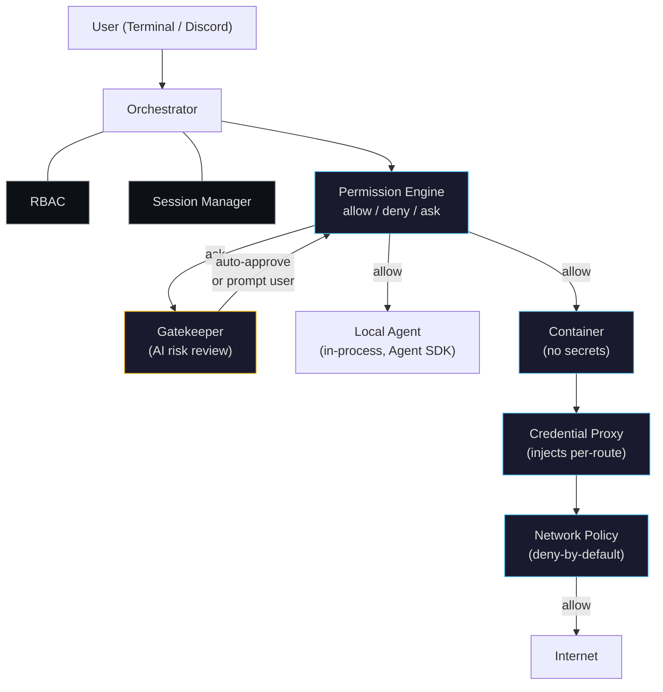
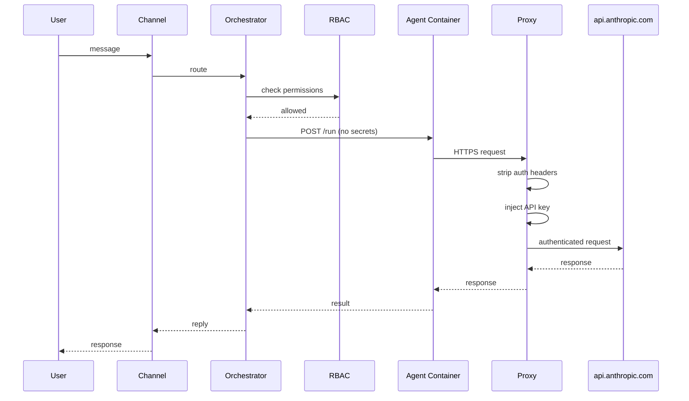
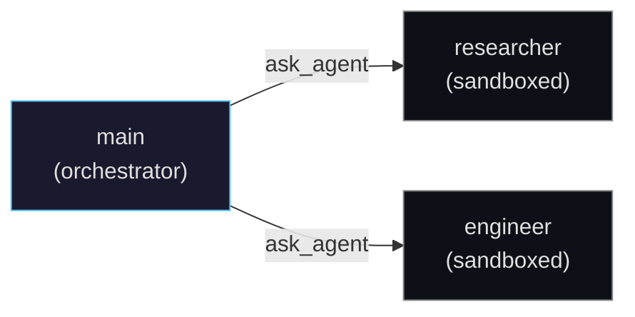

# Stockade

[**dragooon.github.io/stockade**](https://dragooon.github.io/stockade/)

> **Alpha software.** Architecture is stable and tested (749 tests), but APIs and config format may change. Not yet recommended for production use.

Multi-agent orchestrator for Claude with layered security. Agents run in containers with no secrets, no direct internet, and per-tool permission rules — but you can poke precise holes when you need to.

## Contents

- [Built on Claude Code](#built-on-claude-code)
- [Quick Start](#quick-start)
- [Architecture](#architecture)
- [Security Layers](#security-layers)
- [Configuration](#configuration)
- [Project Structure](#project-structure)
- [Comparison](#comparison)
- [Tests](#tests)

## Built on Claude Code

Stockade is built on the [Anthropic Agent SDK](https://github.com/anthropic-ai/claude-code-sdk) (`@anthropic-ai/claude-agent-sdk`) — the same runtime that powers Claude Code. Each agent is a Claude Code session with access to the SDK's built-in tools: `Bash`, `Read`, `Write`, `Edit`, `Glob`, `Grep`, `WebSearch`, `WebFetch`.

What Stockade adds on top:

- **Multi-agent orchestration** — A parent agent delegates to sub-agents via an `ask_agent` MCP tool that the orchestrator injects at runtime. The SDK handles tool execution; Stockade handles routing, permissions, and identity propagation.
- **Remote execution** — The worker package wraps the SDK's `query()` function in an HTTP server. The orchestrator POSTs to it; the SDK runs inside the container. Same Claude Code session, different process boundary.
- **Permission layer** — The SDK exposes tools to agents. Stockade intercepts tool invocations and evaluates them against per-agent `allow`/`deny`/`ask` rules before execution. Unmatched invocations require human approval.
- **Credential isolation** — The SDK needs an API key to call Anthropic. Instead of passing it into the container, Stockade routes all HTTPS through a MITM proxy that injects the key at the network level. The SDK works normally; it just doesn't know the real key.
- **Session management** — The SDK's `sessionId` is used to resume conversations. Stockade maps channel scopes (e.g., `discord:server:channel:user`) to session IDs in SQLite, so conversations persist across messages.

## Quick Start

```bash
git clone https://github.com/Dragooon/stockade.git
cd stockade
pnpm install

# Copy and edit config
cp config/config.example.yaml config/config.yaml
cp config/proxy.example.yaml config/proxy.yaml

# Add your API key
mkdir -p config/secrets
echo "your-anthropic-api-key" > config/secrets/anthropic-api-key

# Start
pnpm start:orchestrator
```

The default config runs all agents sandboxed in containers. Edit `config/config.yaml` to customize.

To run agents locally without containers (simpler, less secure), set `sandboxed: false` on any agent.

## Architecture



Three packages:

| Package | Role |
|---|---|
| **`orchestrator`** | Config, routing, RBAC, sessions, channels, dispatch, container lifecycle |
| **`worker`** | HTTP server wrapping Agent SDK `query()`, runs inside containers |
| **`proxy`** | MITM credential proxy: route-based secret injection, network policy, TLS interception |

### Message flow



### Sub-agent delegation



The orchestrator delegates to sub-agents via the `ask_agent` MCP tool. RBAC is enforced through the entire chain — the original caller's identity flows through every hop.

## Security Layers

**1. Container isolation** — Sandboxed agents run in Docker on an internal network. No direct internet access.

**2. Credential proxy** — All outbound HTTP goes through a MITM proxy that strips auth headers and injects credentials per route. Agents never see API keys.

**3. Tool permissions** — Per-agent, first-match-wins rules with three actions:

| Action | Behavior |
|---|---|
| `allow` | Tool invocation proceeds silently |
| `deny` | Tool invocation is blocked |
| `ask` | Human-in-the-loop approval required (default when no rule matches) |

```yaml
permissions:
  - "deny:Write(/config/**)"     # block config writes
  - "deny:Bash(rm *)"            # block rm commands
  - "allow:Bash(git *)"          # allow git
  - "allow:Read"                 # allow all reads
  - "ask:Write"                  # prompt user for other writes
  # no match → ask (HITL approval)
```

Selectors support tool names, path globs, and command globs. Paths resolve `~/` (home), `/` (platform root), `./` (agent cwd), and `//` (absolute). Symlinks are resolved and `..` traversal is normalized.

**4. Gatekeeper** — Optional AI-powered risk assessment for `ask` rules. Before a tool invocation reaches the user, a gatekeeper agent reviews it and assigns a risk level (low/medium/high/critical). Low-risk actions can be auto-approved with a notification; higher-risk actions are presented with the risk review attached.

```yaml
gatekeeper:
  enabled: true
  agent: reviewer          # any agent defined in config
  auto_approve_risk: low   # auto-approve low-risk, prompt for rest
```

**5. RBAC** — Users get roles that control which agents and tools they can access. Identity flows through the entire sub-agent chain — a Discord user's permissions apply even when the orchestrator delegates three levels deep.

**6. Network policy** — Deny-by-default allowlist. Each host/path/method combination is explicitly allowed or denied:

```yaml
policy:
  default: deny
  rules:
    - host: "api.anthropic.com"
      action: allow
    - host: "api.github.com"
      method: "GET"
      action: allow
    - host: "api.github.com"
      action: deny              # block non-GET GitHub requests
```

## Configuration

Single YAML file defines everything: agents, channels, RBAC, containers.

```yaml
agents:
  main:
    model: claude-sonnet-4-6
    tools: [Bash, Read, Write, Edit, Glob, Grep]
    subagents: [researcher, engineer]
    sandboxed: true
    permissions:
      - "deny:Write(/config/**)"
      - "allow:*"

  researcher:
    model: claude-haiku-4-5-20251001
    tools: [Read, WebSearch, WebFetch]
    sandboxed: true
    permissions:
      - "allow:Read"
      - "allow:WebSearch"
      - "allow:WebFetch"
```

See [`config/config.example.yaml`](config/config.example.yaml) for the full default config and [`config/proxy.example.yaml`](config/proxy.example.yaml) for network policy.

### Discord

```yaml
channels:
  discord:
    enabled: true
    token: ${DISCORD_TOKEN}
    bindings:
      - server: "YOUR_SERVER_ID"
        agent: main
        channels: "*"
```

## Project Structure

```
stockade/
├── packages/
│   ├── orchestrator/    # Core: config, RBAC, sessions, routing, channels, containers
│   ├── worker/          # Container HTTP server (Hono + Agent SDK)
│   └── proxy/           # Credential proxy (HTTP MITM + SSH tunnel + gateway)
├── config/
│   ├── config.example.yaml   # Default sandboxed config
│   └── proxy.example.yaml    # Proxy + network policy config
└── data/                     # Runtime data (gitignored)
```

## Comparison

| | [OpenClaw](https://github.com/openclaw/openclaw) | [NanoClaw](https://github.com/qwibitai/nanoclaw) | [NemoClaw](https://github.com/NVIDIA/NemoClaw) | Stockade |
|---|---|---|---|---|
| **Isolation** | Optional containers, app-level permissions | Container per group | Landlock + seccomp + netns | Container + RBAC + tool permissions + network policy |
| **Credentials** | In-process | Gateway injection | Host-only via OpenShell | MITM proxy, per-route, zero secrets in container |
| **Multi-agent** | Single | Single per group | Single (wraps OpenClaw) | Hierarchical delegation with `ask_agent` MCP |
| **Codebase** | ~500k lines | ~2k lines | Thin CLI over OpenClaw | ~8k lines, 749 tests |
| **Status** | Production | Production | Alpha | Alpha |

## Tests

```bash
pnpm test              # all packages
pnpm -F @stockade/orchestrator test   # orchestrator only
pnpm -F @stockade/proxy test          # proxy only
```

749 tests across 3 packages: orchestrator (614), proxy (117), worker (18).

## Requirements

- Node.js 22+
- pnpm
- Docker (for sandboxed agents)

## License

MIT
