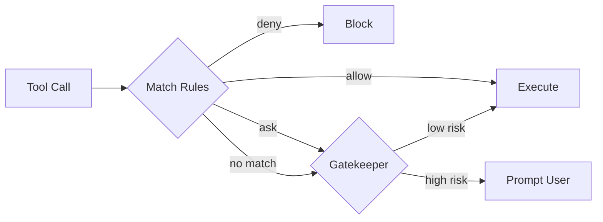
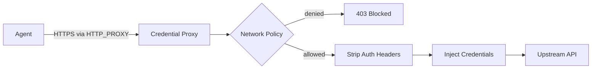
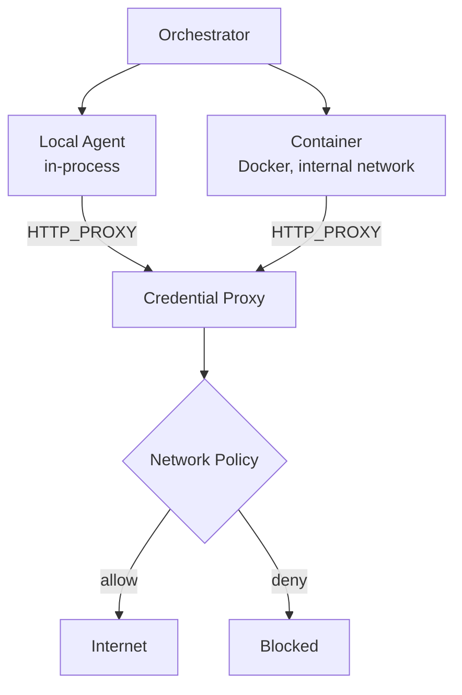
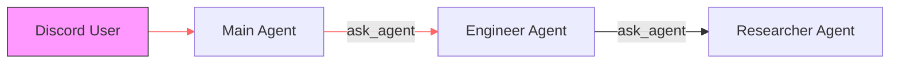

# Stockade

[**dragooon.github.io/stockade**](https://dragooon.github.io/stockade/)

> **Alpha Software:** Still in development and being tested, not recommended in production. Always default to sandboxed agents if you are not sure what you're doing. Never give Agents access to credentials or files that you cannot afford to lose.

Multi-agent orchestrator for Claude with layered security. Agents run in containers with no secrets, no direct internet, and per-tool permission rules — but you can poke precise holes when you need to.

## Contents

- [Built on Claude Code](#built-on-claude-code)
- [Quick Start](#quick-start)
- [How It Works](#how-it-works)
  - [Tool Permissions](#tool-permissions)
  - [Credential Management](#credential-management)
  - [Container Isolation](#container-isolation)
  - [RBAC](#rbac)
- [Configuration](#configuration)
- [Comparison](#comparison)
- [Tests](#tests)

## Built on Claude Code

Stockade runs on the [Anthropic Agent SDK](https://github.com/anthropic-ai/claude-code-sdk) — the same runtime that powers Claude Code. Each agent is a Claude Code session with tools like `Bash`, `Read`, `Write`, `Edit`, `WebSearch`, and `WebFetch`.

Stockade adds multi-agent orchestration, container isolation, credential injection, and a permission system on top. See the [architecture docs](https://dragooon.github.io/stockade/architecture) for details.

## Quick Start

```bash
git clone https://github.com/Dragooon/stockade.git
cd stockade
pnpm install

cp config/config.example.yaml config/config.yaml
cp config/proxy.example.yaml config/proxy.yaml

mkdir -p config/secrets
echo "your-anthropic-api-key" > config/secrets/anthropic-api-key

pnpm start:orchestrator
```

The default config runs all agents sandboxed in containers. Set `sandboxed: false` on any agent to run it locally without Docker.

See the [quick start guide](https://dragooon.github.io/stockade/quickstart) for more detail including Discord setup.

## How It Works

You define agents, permissions, and channels in a single YAML file. Agents can delegate to each other. Six security layers protect the system:

| Layer | What it does |
|---|---|
| **Containers** | Sandboxed agents run in Docker on an internal network |
| **Credential proxy** | Injects API keys per route — agents never see secrets |
| **Tool permissions** | `allow` / `deny` / `ask` rules per agent, per tool, per path |
| **Gatekeeper** | AI risk review for tool invocations that need approval |
| **RBAC** | User roles control access, identity flows through sub-agent chains |
| **Network policy** | Deny-by-default allowlist per host/path/method |

### Tool Permissions

Every tool invocation hits a first-match-wins rule engine before it executes:



Rules are per-agent with path and command globs — `allow:Bash(git *)` lets an agent run git but nothing else in Bash. `deny:Write(/config/**)` blocks config writes regardless of other rules.

### Credential Management

Any agent with `credentials` configured routes through the credential proxy — sandboxed or local. The proxy strips auth headers and injects real credentials per route. Agents never see API keys.



Sandboxed agents are forced through the proxy (it's their only route out). Local agents route through it automatically when the proxy is running and the agent has credentials configured. If the proxy is down, local agents fall back to host credentials.

### Container Isolation



Containers have no direct internet access — the proxy is the only way out. Local agents route through the proxy when credentials are configured, falling back to host credentials if the proxy is down. Both paths enforce the same deny-by-default network policy.

### RBAC

User identity flows through the entire sub-agent delegation chain. If a Discord user's role denies `Bash`, that applies to every agent acting on their behalf — even three levels deep.



User permissions are checked at every delegation boundary — not just the first agent.

See the [architecture docs](https://dragooon.github.io/stockade/architecture) for full details on message flow, container lifecycle, and credential proxy internals.

## Configuration

```yaml
agents:
  main:
    model: claude-sonnet-4-6
    tools: [Bash, Read, Write, Edit, Glob, Grep]
    subagents: [researcher]
    sandboxed: true
    permissions:
      - "deny:Write(/config/**)"
      - "allow:*"

  researcher:
    model: claude-haiku-4-5-20251001
    tools: [Read, WebSearch, WebFetch]
    sandboxed: true
```

See [`config/config.example.yaml`](config/config.example.yaml) for the full default and the [configuration reference](https://dragooon.github.io/stockade/configuration) for all options.

## Comparison

| | OpenClaw | NanoClaw | NemoClaw | Stockade |
|---|---|---|---|---|
| **Isolation** | Optional containers, app-level perms | Container per group | Landlock + seccomp + netns | Container + RBAC + permissions + proxy + network |
| **Credentials** | In-process | Gateway injection | Host-only via OpenShell | MITM proxy, per-route, zero secrets in container |
| **Multi-agent** | Single | Single per group | Single (wraps OpenClaw) | Hierarchical delegation with `ask_agent` MCP |
| **Codebase** | ~500k lines | ~2k lines | Thin CLI over OpenClaw | ~8k lines, 749 tests |
| **Status** | Production | Production | Alpha | Alpha |

## Tests

```bash
pnpm test              # all 749 tests
```

749 tests across 3 packages: orchestrator (614), proxy (117), worker (18).

## Requirements

- Node.js 22+
- pnpm
- Docker (for sandboxed agents)

## License

MIT
